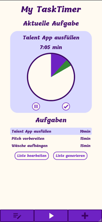

# My TaskTimer

My TaskTimer is a ADHD friendly housekeeping/ToDo App.
You can add tasks and how much time you planed. With this tasks you can create a list of those you want to do or let the app generation one for you. While working on your list you see the current task and how much time for the tasks is left. As specialty you have an analog clock wich displays the remaining time.

## About

The app is my capstone projekt for the web development bootcamp from @neuefische. During the last four weeks of the bootcamp we had to develop our own web app in a projekt setup. We had to write user stories, review the code of each other and do quality assurance.

## Tech-Stack

-   [Next.js](https://nextjs.org/)
-   [Jest](https://jestjs.io/)
-   [Testing Library](https://testing-library.com/)
-   [Stylelint](https://stylelint.io/)
-   [Eslint](https://eslint.org/)
-   [Prettier](https://prettier.io/)
-   [Husky](https://typicode.github.io/husky/)
-   [Zustand](https://zustand-demo.pmnd.rs/)
-   [Styled Components](https://styled-components.com/)
-   [@hello-pangea/dnd](https://github.com/hello-pangea/dnd)

## Project Setup

-   Clone this repository
-   Install all dependencies with `$ npm install`
-   Run app in dev mode with `$ npm run dev`
-   Server: [http://localhost:3000/](http://localhost:3000/)
-   Run tests via `$ npm run test`
